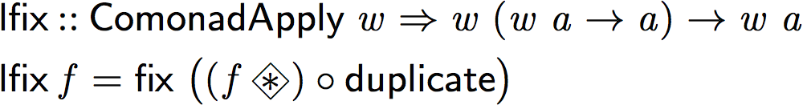

Functional Pearl: Getting a Quick Fix on Comonads
-------------------------------------------------

This repository is the source for the paper: **K. Foner. "Functional  Pearl: Getting  a  Quick  Fix on Comonads." In *Proceedings of the 2015 ACM SIGPLAN Symposium on Haskell.*  ACM, 2015.**

The paper is written in literate Haskell. It can be compiled both to a readable PDF and to executable code for the library it describes.

The quickest way to read the paper is to [download the compiled pre-print PDF](https://github.com/kwf/GQFC/raw/master/GQFC.pdf).

To read the source code or play around with it in a REPL, you can [build the accompanying artifacts](https://github.com/kwf/GQFC#building-the-artifacts).

## Abstract

A piece of functional programming folklore due to Piponi provides Löb's theorem from modal provability logic with a computational interpretation as an unusual fixed point. Interpreting modal necessity as an arbitrary `Functor` in Haskell, the "type" of Löb's theorem is inhabited by a fixed point function allowing each part of a structure to refer to the whole.

However, `Functor`'s logical interpretation may be used to prove Löb's theorem only by relying on its implicit functorial strength, an axiom not available in the provability modality. As a result, the well known loeb fixed point "cheats" by using functorial strength to implement its recursion.

Rather than `Functor`, a closer Curry analogue to modal logic's Howard inspiration is a closed (semi-)comonad, of which Haskell's `ComonadApply` typeclass provides analogous structure. Its computational interpretation permits the definition of a novel fixed point function allowing each part of a structure to refer to its own context within the whole. This construction further guarantees maximal sharing and asymptotic efficiency superior to loeb for locally contextual computations upon a large class of structures. With the addition of a distributive law, closed comonads may be composed into spaces of arbitrary dimensionality while preserving the performance guarantees of this new fixed point.

From these elements, we construct a small embedded domain-specific language to elegantly express and evaluate multidimensional "spreadsheet-like" recurrences for a variety of cellular automata.

## Building the Artifacts

To build all the paper's artifacts, you need:

- A version of `GHC` 7.8 or greater
- A version of `cabal` supporting sandboxes (i.e. 1.18 or greater)
- A working `LaTeX` installation
- [`latexmk`](https://www.ctan.org/pkg/latexmk/?lang=en) (which may have come with your `LaTeX` distribution)
- [`lhs2TeX`](http://www.andres-loeh.de/lhs2tex) (to get it:  `cabal install lhs2tex`)
- [`unlit`](https://hackage.haskell.org/package/unlit) (to get it: `cabal install unlit`)

The script `./build-everything` creates a `cabal` sandbox and builds all artifacts.

After that, you can...

- open `./GQFC.pdf` to read the paper
- run `cabal repl` to launch a REPL with the paper's code
- open `./GQFC.hs` to read *only* the code, eliding the paper text

To re-build an individual artifact:

- `./build-paper` to re-render the paper
- `./build-code` to re-compile the library
- `./extract-code` to re-extract the library code
